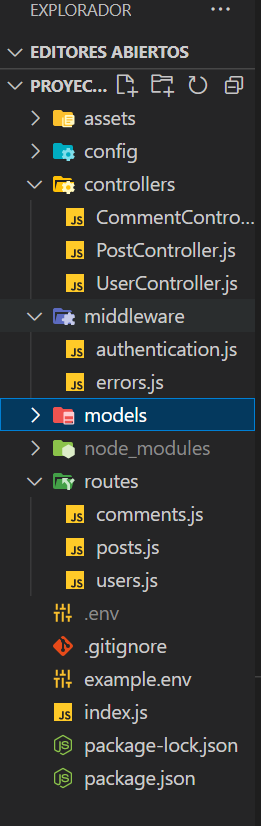
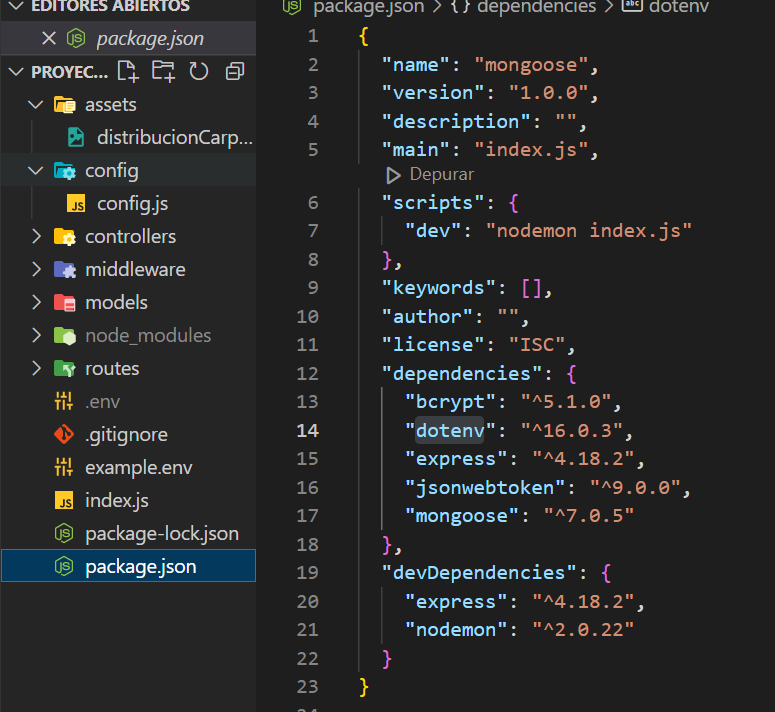

<h1>RED SOCIAL PROJECT 🖥️🛒 </h1>


Descripción 📋
---

El proyecto consiste en una red social hecha con Node.js y MongoDB que muestra la funcionalidad completa de una red social.
La aplicación permite a los usuarios crear una cuenta, iniciar sesión, publicar contenido y realizar acciones comunes de una red social, como editar y eliminar publicaciones...
<br>
En general, el proyecto es una muestra sólida de habilidades de desarrollo web, incluyendo la capacidad de trabajar con tecnologías backend como Node.js y MongoDB

Objetivos 🎯
---

		
una API REST que sea capaz de lo siguiente:


* Registro de usuarios usando Bcrypt.
* Login de usuarios + token + middleware.
* Que sea capaz de crear un CRUD.
* Dar/quitar Like a post.
* Backend disponible en producción.


Distribucion de carpetas en VSC 🖥️ 
---




Tecnologias 🛠
---
* MongoDB and Atlas mongoDB
* Postman -for endpoint testing
* Node.JS

* <h3>Packages:</h3>
* express
* mongoose
* jsonwebtoken
* bcryptjs
* nodemon
* dotenv





Instalación ⚙️
---

1. **Clona el repositorio**

```
https://github.com/valenti94br/ProyectoBackend-Mongoose.git
 ```
 
2. **Instala las dependencias**
 
 ```
 npm install
 ```
 
3. **Configurar variables de entorno**


4. **Levanta el servidor**

```
npm run dev
```

Autores 🧑‍✒️
---

* Gonzalo Martí - [goner10](https://github.com/Goner10)

* Valentí Barat- [valenti94br](https://github.com/valenti94br)

		
